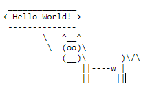

# caas

## Information

- picoMini by redpwn
- Web Exploitation
- 150 Points

## Description

Now presenting [cowsay as a service](https://caas.mars.picoctf.net/)

## Hints

(None)

## Solution

The website is a cowsay as a service website, where when we go to the webpage `https://caas.mars.picoctf.net/cowsay/{message}`, cowsay will say whatevery is in `{message}`.

For example, if we go to the https://caas.mars.picoctf.net/cowsay/%22Hello%20World!%22, the webpage will show us:

However, we have the message be `hi;ls;`. This will give us the following webpage.

This means that we can execute Linux commands in the address bar. We notice there is a file called `falg.txt`, so to open it we can just go to https://caas.mars.picoctf.net/cowsay/hi;cat%20falg.txt, where the flag will be the output.

## Flag

picoCTF{moooooooooooooooooooooooooooooooooooooooooooooooooooooooooooo0o}
