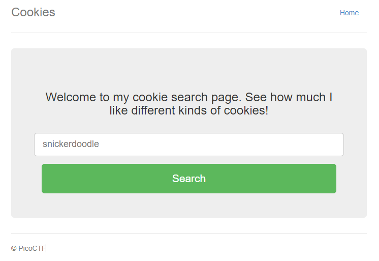
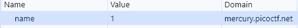
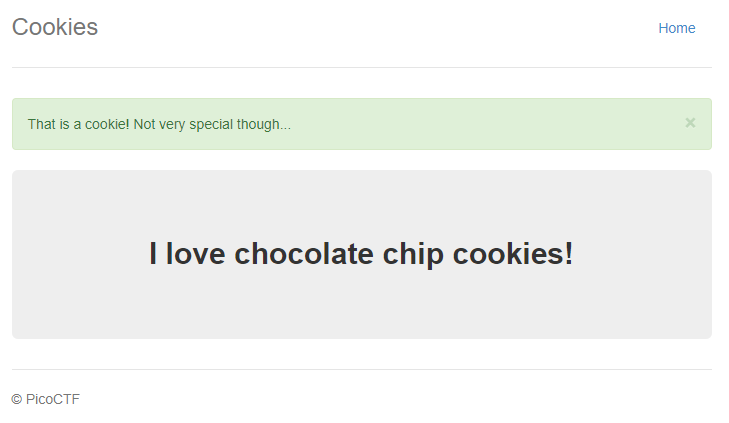
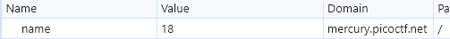
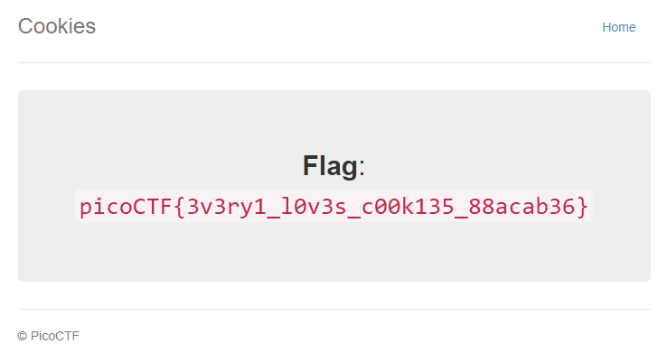

# Cookies

## Information

- picoCTF 2021
- Web Exploitation
- 40 Points

## Description

Who doesn't love cookies? Try to figure out the best one. http://mercury.picoctf.net:6418/

## Hints

(None)

## Solution

As the title of the challenge suggests, this challenge is all about cookies. When visting the website for the first time, we are greeted with a prompt telling us to enter a cookie name.

The website has a cookie called "name" with a value of -1. Entering "snickerdoodle" changes the value to 0 and if we enter "chocolate chip" the value changes to 1. This means that the value of the "name" cookie might be something to do with this challenge.

Change the value of the cookie and a new cookie type should appear. For example, if value is changed to 2, then we should see the prompt changes to "oatmeal raisin" cookies.

The flag can be found by changing the value to 18.

## Flag

picoCTF{3v3ry1_l0v3s_c00k135_88acab36}
