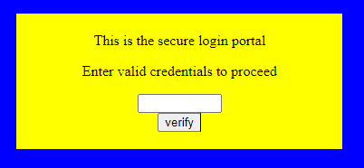
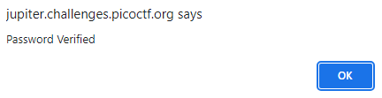

# dont-use-client-side

## Information

- picoCTF 2019
- Web Exploitation
- 100 Points

## Description

Can you break into this super secure portal? `https://jupiter.challenges.picoctf.org/problem/29835/` ([link](https://jupiter.challenges.picoctf.org/problem/29835/)) or http://jupiter.challenges.picoctf.org:29835

## Hints

1. Never trust the client

## Solution

When we first visit the website we are greeted with a form which asks us to enter "valid credentials to proceed".



Inspecting the HTML source code we find the `verify` function.

```js
function verify() {
    checkpass = document.getElementById("pass").value;
    split = 4;
    if (checkpass.substring(0, split) == 'pico') {
      if (checkpass.substring(split*6, split*7) == '723c') {
        if (checkpass.substring(split, split*2) == 'CTF{') {
         if (checkpass.substring(split*4, split*5) == 'ts_p') {
          if (checkpass.substring(split*3, split*4) == 'lien') {
            if (checkpass.substring(split*5, split*6) == 'lz_7') {
              if (checkpass.substring(split*2, split*3) == 'no_c') {
                if (checkpass.substring(split*7, split*8) == 'e}') {
                  alert("Password Verified")
                  }
                }
              }

            }
          }
        }
      }
    }
    else {
      alert("Incorrect password");
    }
```

From this function we can piece together the flag starting from indexes 0 to 4 which is "pico", then 4 to 8 which is "CTF{" and so on.

If the correct flag is entered, an alert will pop up saying "Password Verified".



## Flag

picoCTF{no_clients_plz_7723ce}
