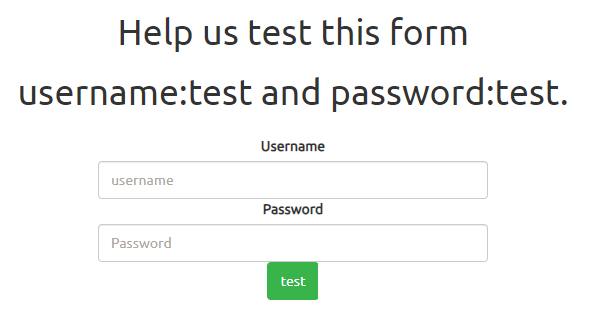
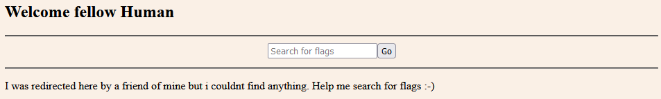
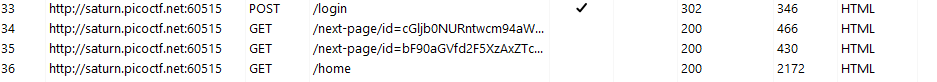

# findme

## Information

- picoCTF 2023
- Web Exploitation
- 100 Points

## Description

Help us test the form by submiting the username as `test` and password as `test!`
The website running [here](http://saturn.picoctf.net:60515/).

## Hints

1. any redirections?

## Solution

Going to the given website we are greeted with a login screen.

Using the given username of `test` and password of `test!` we are able to login to another webpage where we can search for flags.

However, the hint tells us to look at redirections, so using Burp Suite, we are able to see two directions.

From both HTTP request messages we can see some strings encoded with Base64 in the next page id. `cGljb0NURntwcm94aWVzX2Fs` for the first request and `bF90aGVfd2F5XzAxZTc0OGRifQ==` for the second. Decoding the two strings and combining them will give us the flag.

## Flag

picoCTF{proxies_all_the_way_01e748db}
