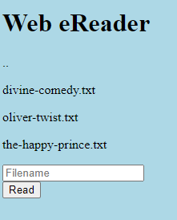

# Forbidden Paths

## Information

- picoCTF 2022
- Web Exploitation
- 200 Points

## Description

Can you get the flag?
Here's the [website](http://saturn.picoctf.net:64403/).
We know that the website files live in `/usr/share/nginx/html/` and the flag is at `/flag.txt` but the website is filtering absolute file paths. Can you get past the filter to read the flag?

## Hints

(None)

## Solution

We see a Web eReader website, where we can read from three different books.

Typing `/usr/share/nginx/html/flag.txt` into the text input field will give us a "Not Authorized" message, so we need another way.

This can be achieve by using `../` in place of the directories. So we can enter `../../../../../flag.txt` and the `flag.txt` will be read and the flag shown.

## Flag

picoCTF{7h3_p47h_70_5ucc355_e5fe3d4d}
