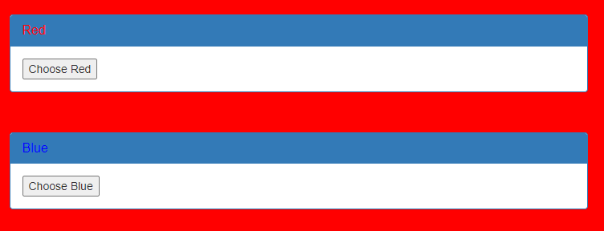

# GET aHEAD

## Information

- picoCTF 2021
- Web Exploitation
- 20 Points

## Description

Find the flag being held on this server to get ahead of the competition http://mercury.picoctf.net:53554/

## Hints

1. Maybe you have more than 2 choices

2. Check out tools like Burpsuite to modify your requests and look at the responses

## Solution

On the website, we have the ability to change the background colour to either blue or red.



Using Burp Suite we can intercept an HTTP requests made by the wbsite. Inspecting these requests we can see that a "GET" was used for Red and "POST" was used for Blue.

```HTML
<div class="panel-body">
    <form action="index.php" method="GET">
        <input type="submit" value="Choose Red"/>
    </form>
</div>
```

```HTML
<form action="index.php" method="POST">
    <input type="submit" value="Choose Blue"/>
</form>
```

From the title of the challenge as a hint we can use the "HEAD" request method. Modify one of these requests to use the "HEAD" request method and after forwarding this modified request the flag will be shown.

## Flag

picoCTF{r3j3ct_th3_du4l1ty_2e5ba39f}
