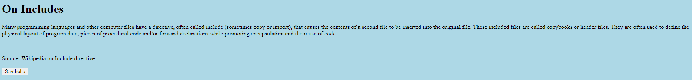
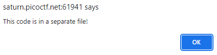

# Includes

## Information

- picoCTF 2022
- Web Exploitation
- 100 Points

## Description

Can you get the flag?
Go to this [website](http://saturn.picoctf.net:61941/) and see what you can discover.

## Hints

1. Is there more code than what the inspector initially shows?

## Solution

Going to the given website gives us this webpage about the Include directive.



When we click on the button that says "Say Hello", we see an alert saying "This code is in a separate file!".



This hints at the fact that we need to go to the sources tab to see the HTML, CSS and JS files.

There is nothing of particular interest in the HTML file.

But in the CSS file we see the first part of our flag on line 5.

```css
body {
  background-color: lightblue;
}

/*  picoCTF{1nclu51v17y_1of2_  *
```

And we also see the second part of our flag on line 9 in the JS file.

```js
function greetings() {
  alert("This code is in a separate file!");
}

//  f7w_2of2_6edef411}
```

## Flag

picoCTF{1nclu51v17y_1of2_f7w_2of2_6edef411}
