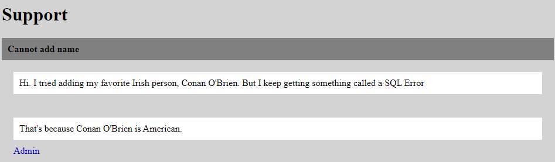
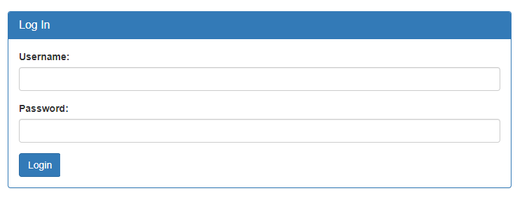

# Irish-Name-Repo 1

## Information

- picoCTF 2019
- Web Exploitation
- 300 Points

## Description

There is a website running at `https://jupiter.challenges.picoctf.org/problem/50009/` ([link](https://jupiter.challenges.picoctf.org/problem/50009/)) or http://jupiter.challenges.picoctf.org:50009. Do you think you can log us in? Try to see if you can login!

## Hints

1. There doesn't seem to be many ways to interact with this. I wonder if the users are kept in a database?

2. Try to think about how the website verifies your login.

## Solution

Going to the website we see a list of famous Irish people.

Clicking on the hamburger icon in the top left of the page gives us several other pages we can visit.

Going to the support page, reveals that the website uses a SQL database to handle adding in new Irish people.

Going to the Admin Login page, we can assume the log in is also handled through an SQL query. Therefore we can login with the username being `admin'--` and the password being any string.

After entering the details, we see we are loged in successfully and the flag is revealed.

## Flag

picoCTF{j5_15_7r4n5p4r3n7_b0c2c9cb}
