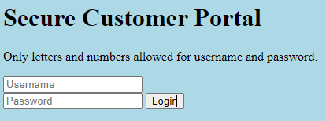
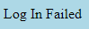
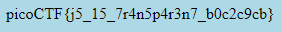

# Local Authority

## Information

- picoCTF 2022
- Web Exploitation
- 100 Points

## Description

Can you get the flag?
Go to this [website](http://saturn.picoctf.net:49386/) and see what you can discover.

## Hints

1. How is the password checked on this website?

## Solution

Going to the given website gives us this webpage with a login form.



Entering a random username and password will lead us to a webpage that tells us we've failed to login.



But from the sources we can see a JavaScript file called "secure.js". Opening the file reveals the following piece of code which reveals the username is "admin" and the password is "strongPassword098765".

```js
function checkPassword(username, password) {
  if (username === "admin" && password === "strongPassword098765") {
    return true;
  } else {
    return false;
  }
}
```

Going back to the original webpage, we enter in these details and the webpage redirects us to another webpage with the flag.



## Flag

picoCTF{j5_15_7r4n5p4r3n7_b0c2c9cb}
