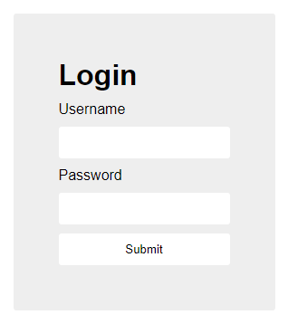

# login

## Information

- picoMini by redpwn
- Web Exploitation
- 100 Points

## Description

My dog-sitter's brother made this website but I can't get in; can you help?
login.mars.picoctf.net

## Hints

(None)

## Solution

When we first visit the website we are greeted with a login screen telling us to input a username and password.



Going to the JavaScript file for this webpage we can see the following code:

```js
(async () => {
  await new Promise((e) => window.addEventListener("load", e)),
    document.querySelector("form").addEventListener("submit", (e) => {
      e.preventDefault();
      const r = {
          u: "input[name=username]",
          p: "input[name=password]",
        },
        t = {};
      for (const e in r)
        t[e] = btoa(document.querySelector(r[e]).value).replace(/=/g, "");
      return "YWRtaW4" !== t.u
        ? alert("Incorrect Username")
        : "cGljb0NURns1M3J2M3JfNTNydjNyXzUzcnYzcl81M3J2M3JfNTNydjNyfQ" !== t.p
        ? alert("Incorrect Password")
        : void alert(`Correct Password! Your flag is ${atob(t.p)}.`);
    });
})();
```

There are two strings that we are interested in "YWRtaW4" and "cGljb0NURns1M3J2M3JfNTNydjNyXzUzcnYzcl81M3J2M3JfNTNydjNyfQ" which are strings encoded with Base64. These strings are the username and password respectively.

Decrypting "YWRtaW4" will give us "admin" and decrypting "cGljb0NURns1M3J2M3JfNTNydjNyXzUzcnYzcl81M3J2M3JfNTNydjNyfQ" will give us "picoCTF{53rv3r_53rv3r_53rv3r_53rv3r_53rv3r}" which is the flag.

## Flag

picoCTF{53rv3r_53rv3r_53rv3r_53rv3r_53rv3r}
