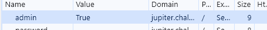

# logon

## Information

- picoCTF 2019
- Web Exploitation
- 100 Points

## Description

The factory is hiding things from all of its users. Can you login as Joe and find what they've been looking at? `https://jupiter.challenges.picoctf.org/problem/15796/` ([link](https://jupiter.challenges.picoctf.org/problem/15796/)) or http://jupiter.challenges.picoctf.org:15796

## Hints

1. Hmm it doesn't seem to check anyone's password, except for Joe's?

## Solution

Going to the provided website we get this screen:


The HTML for this page is:

```HTML
<!DOCTYPE html>
<html lang="en">

<head>
    <title>Factory Login</title>


    <link href="https://maxcdn.bootstrapcdn.com/bootstrap/3.2.0/css/bootstrap.min.css" rel="stylesheet">

    <link href="https://getbootstrap.com/docs/3.3/examples/jumbotron-narrow/jumbotron-narrow.css" rel="stylesheet">

    <script src="https://ajax.googleapis.com/ajax/libs/jquery/3.3.1/jquery.min.js"></script>

    <script src="https://maxcdn.bootstrapcdn.com/bootstrap/3.3.7/js/bootstrap.min.js"></script>


</head>

<body>

    <div class="container">
        <div class="header">
            <nav>
                <ul class="nav nav-pills pull-right">
                    <li role="presentation" class="active"><a href="/">Home</a>
                    </li>
                    <li role="presentation"><a href="/logout" class="btn btn-link pull-right">Sign Out</a>
                    </li>
                </ul>
            </nav>
            <h3 class="text-muted">Factory Login</h3>
        </div>

        <!-- Categories: success (green), info (blue), warning (yellow), danger (red) -->


        <div class="alert alert-danger alert-dismissible" role="alert" id="myAlert">
          <button type="button" class="close" data-dismiss="alert" aria-label="Close"><span aria-hidden="true">&times;</span></button>
          <!-- <strong>Title</strong> --> I&#39;m sorry Joe&#39;s password is super secure. You&#39;re not getting in that way.
            </div>


      <div class="jumbotron">
        <p class="lead"></p>
        <div class="login-form">
            <form role="form" action="/login" method="post">
                <div class="form-group">
                    <input type="text" name="user" id="email" class="form-control input-lg" placeholder="Username">
                </div>
                <div class="form-group">
                    <input type="password" name="password" id="password" class="form-control input-lg" placeholder="Password">
                </div>
            </div>
            <div class="row">
                <div class="col-xs-12 col-sm-12 col-md-12">
                    <input type="submit" class="btn btn-lg btn-success btn-block" value="Sign In">
                </div>
            </div>
        </form>
    </div>
    <footer class="footer">
        <p>&copy; PicoCTF 2019</p>
    </footer>

</div>

<script>
$(document).ready(function(){
    $(".close").click(function(){
        $("myAlert").alert("close");
    });
});
</script>
</body>

</html>
```

To login, we can simply not enter anything and press the "Sign In" button. We should end up on this page:


Viewing all the cookies for this webpage, we can see a cookie called "admin" with "False" as the value.


Setting the value to "True" and refreshing the page will reveal the flag.




## Flag

picoCTF{th3_c0nsp1r4cy_l1v3s_6edb3f5f}
