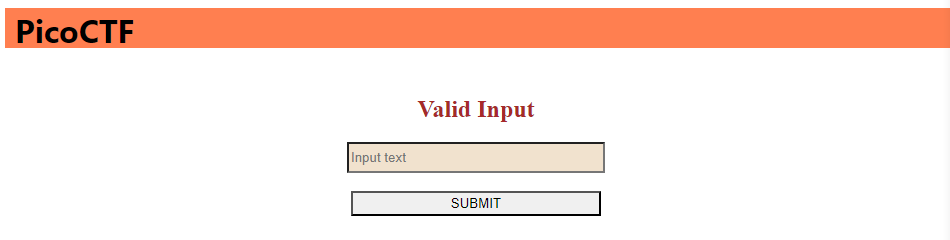

# MatchTheRegex

## Information

- picoCTF 2023
- Web Exploitation
- 100 Points

## Description

How about trying to match a regular expression
The website running [here](http://saturn.picoctf.net:65359/).

## Hints

1. Access the webpage and try to match the regular expression associated with the text field

## Solution

Going to the given website we are told to input text and see if it is valid.



Going to the HTML file for this page reveals a regex expression that we have to match on line 57.

```html
// ^p.....F!?
```

This is translated as:

1. `^`: This asserts the start of a line. It indicates that the pattern following it should match only at the beginning of a line.

2. `p`: This matches the literal character 'p'.

3. `.....`: This matches any five characters. The dot (.) is a wildcard that matches any single character, and there are five dots in a row, so it matches any five characters.

4. `F`: This matches the literal character 'F'.

5. `!?`: This is an optional part of the pattern. The ! is a literal character, and ? makes it optional. So, this part matches zero or one '!' character.

Therefore some potential strings that would match this expression are:

- picoCTF
- pabcdeF
- pxyz!F

After entering any valid strings that match the regrex expression an alter should pop up and reveal the flag.

## Flag

picoCTF{succ3ssfully_matchtheregex_f89ea585}
