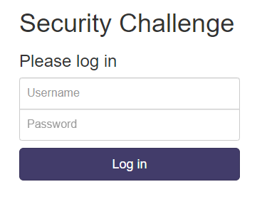
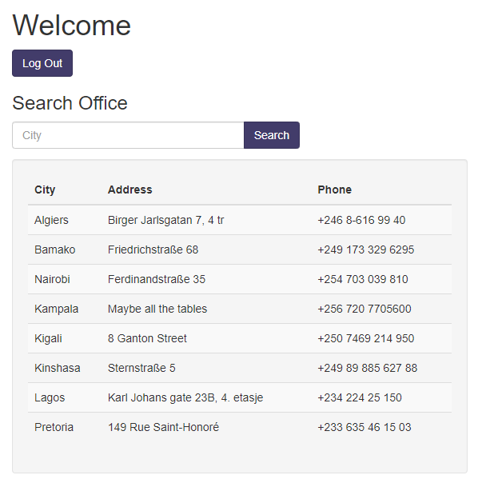
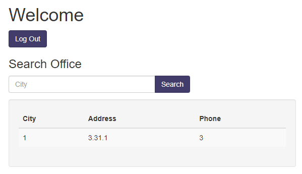
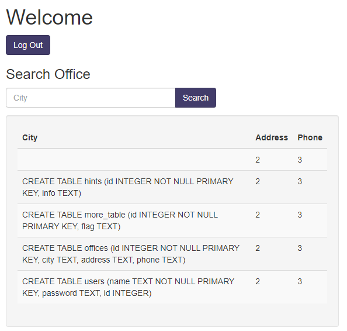
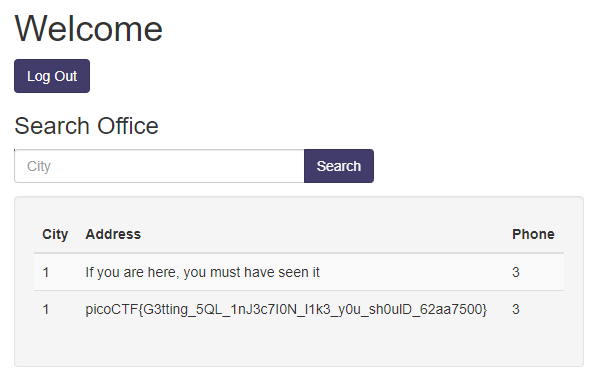

# More SQLi

## Information

- picoCTF 2023
- Web Exploitation
- 200 Points

## Description

Can you find the flag on this website.
Try to find the flag [here](http://saturn.picoctf.net:55649/).

## Hints

1. SQLiLite

## Solution

Going to the website, we see a sign in form.



When we enter a random username and password such as `admin` and `password`, we see the following output:

```
username: admin
password: password
SQL query: SELECT id FROM users WHERE password = 'password' AND username = 'admin'
```

Meaning, signing in uses the above SQL query. To sign in, all we need to do is provide the password `' OR 1=1;--`. This is because `1=1` will always be true and every after `--` will be ignored. The username can be any string.

Once logged in, we will see a list of offices and have the ability to search for an office.



We can inject SQL code into the search bar. An example would be if we want to find out what version of SQLite, this website is using we can search for `' UNION SELECT 1, sqlite_version(), 3;--`. This query will cause column 2 to show the version which is 3.31.1.



Using this knowledge, we can find the schema of the database present by entering `' UNION SELECT table,s 2, 3 FROM sqlite_master ;--` and the following should appear:



This shows all the tables in the database including their attributes. We see that one of the attributes for the table `more_table` is `flag`.

To access this attribute search for `' UNION SELECT 1, flag, 3 FROM more_table;--` and the output should include the flag on the second line:



## Flag

picoCTF{G3tting_5QL_1nJ3c7I0N_l1k3_y0u_sh0ulD_62aa7500}
