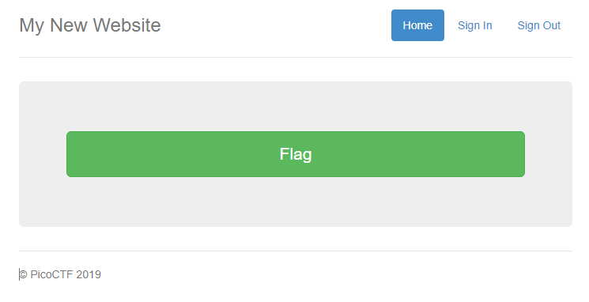
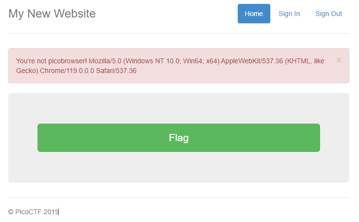
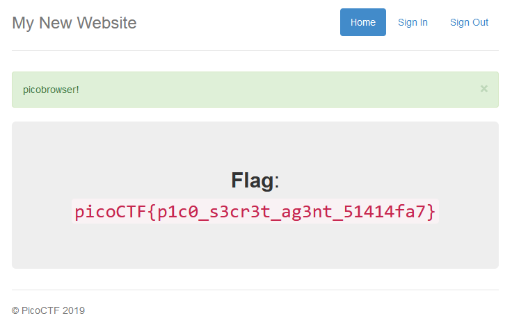

# picobrowser

## Information

- picoCTF 2019
- Web Exploitation
- 200 Points

## Description

This website can be rendered only by picobrowser, go and catch the flag! `https://jupiter.challenges.picoctf.org/problem/50522/` ([link](https://jupiter.challenges.picoctf.org/problem/50522/)) or http://jupiter.challenges.picoctf.org:50522

## Hints

1. You don't need to download a new web browser

## Solution

Going to the website, we are greeted with a green button which will give us the flag.



However, when we click on it it will display a warning message saying we are not using "picobrowser".



We therefore need to change the `User-Agent` header of the HTTP requests to `picobrowser`.

This can be done using Burp Suite and it's Intercept functionality. We have two HTTP requests, so we need to change it twice.

```
GET /flag HTTP/1.1
Host: jupiter.challenges.picoctf.org
Cookie: _ga_BSZFGM3NWK=GS1.1.1700094991.2.1.1700095221.0.0.0; _ga=GA1.1.607665631.1699602461; cf_clearance=fWng1o2Grk7FaravPoa.R54bX1euKcADYEiAq08J3ts-1700094995-0-1-fbfae2db.e327e4eb.acfbbd3b-0.2.1700094995; _ga_L6FT52K063=GS1.2.1700104293.2.1.1700104674.0.0.0
User-Agent: picobrowser
Accept: text/html,application/xhtml+xml,application/xml;q=0.9,image/avif,image/webp,*/*;q=0.8
Accept-Language: en-US,en;q=0.5
Accept-Encoding: gzip, deflate, br
Referer: https://jupiter.challenges.picoctf.org/problem/50522/flag
Upgrade-Insecure-Requests: 1
Sec-Fetch-Dest: document
Sec-Fetch-Mode: navigate
Sec-Fetch-Site: same-origin
Sec-Fetch-User: ?1
Te: trailers
Connection: close


```

```
GET /problem/50522/flag HTTP/1.1
Host: jupiter.challenges.picoctf.org
Cookie: _ga_BSZFGM3NWK=GS1.1.1700094991.2.1.1700095221.0.0.0; _ga=GA1.1.607665631.1699602461; cf_clearance=fWng1o2Grk7FaravPoa.R54bX1euKcADYEiAq08J3ts-1700094995-0-1-fbfae2db.e327e4eb.acfbbd3b-0.2.1700094995; _ga_L6FT52K063=GS1.2.1700104293.2.1.1700104674.0.0.0
User-Agent: picobrowser
Accept: text/html,application/xhtml+xml,application/xml;q=0.9,image/avif,image/webp,*/*;q=0.8
Accept-Language: en-US,en;q=0.5
Accept-Encoding: gzip, deflate, br
Referer: https://jupiter.challenges.picoctf.org/problem/50522/flag
Upgrade-Insecure-Requests: 1
Sec-Fetch-Dest: document
Sec-Fetch-Mode: navigate
Sec-Fetch-Site: same-origin
Sec-Fetch-User: ?1
Te: trailers
Connection: close


```

After editing the two requests, the flag should be shown.



## Flag

picoCTF{p1c0_s3cr3t_ag3nt_51414fa7}
