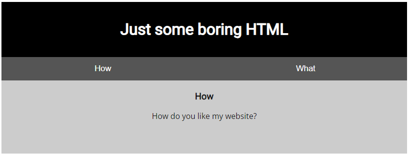
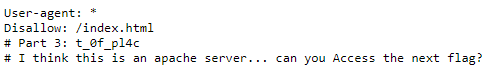
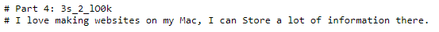
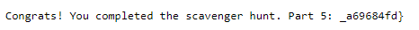

# Scavenger Hunt

## Information

- picoCTF 2021
- Web Exploitation
- 50 Points

## Description

There is some interesting information hidden around this site http://mercury.picoctf.net:27278/. Can you find it?

## Hints

1. You should have enough hints to find the files, don't run a brute forcer.

## Solution

Going to the website, we see the same webpage as [Insp3ct0r](/web-exploitation/insp3ct0r.md):



There are five parts to this challenge. The first two parts are similar to Insp3ct0r, with the parts being located in the `(index)` file on line 31 and `mycss.css` on line 51.

```html
<!DOCTYPE html>
<html>
  <head>
    <title>Scavenger Hunt</title>
    <link
      href="https://fonts.googleapis.com/css?family=Open+Sans|Roboto"
      rel="stylesheet"
    />
    <link rel="stylesheet" type="text/css" href="mycss.css" />
    <script type="application/javascript" src="myjs.js"></script>
  </head>

  <body>
    <div class="container">
      <header>
        <h1>Just some boring HTML</h1>
      </header>

      <button
        class="tablink"
        onclick="openTab('tabintro', this, '#222')"
        id="defaultOpen"
      >
        How
      </button>
      <button class="tablink" onclick="openTab('tababout', this, '#222')">
        What
      </button>

      <div id="tabintro" class="tabcontent">
        <h3>How</h3>
        <p>How do you like my website?</p>
      </div>

      <div id="tababout" class="tabcontent">
        <h3>What</h3>
        <p>
          I used these to make this site: <br />
          HTML <br />
          CSS <br />
          JS (JavaScript)
        </p>
        <!-- Here's the first part of the flag: picoCTF{t -->
      </div>
    </div>
  </body>
</html>
```

```css
div.container {
  width: 100%;
}

header {
  background-color: black;
  padding: 1em;
  color: white;
  clear: left;
  text-align: center;
}

body {
  font-family: Roboto;
}

h1 {
  color: white;
}

p {
  font-family: "Open Sans";
}

.tablink {
  background-color: #555;
  color: white;
  float: left;
  border: none;
  outline: none;
  cursor: pointer;
  padding: 14px 16px;
  font-size: 17px;
  width: 50%;
}

.tablink:hover {
  background-color: #777;
}

.tabcontent {
  color: #111;
  display: none;
  padding: 50px;
  text-align: center;
}

#tabintro {
  background-color: #ccc;
}
#tababout {
  background-color: #ccc;
}

/* CSS makes the page look nice, and yes, it also has part of the flag. Here's part 2: h4ts_4_l0 */
```

However, when we open `myjs.js` we see on line 21,
"How can I keep Google from indexing my website?".

```js
function openTab(tabName, elmnt, color) {
  var i, tabcontent, tablinks;
  tabcontent = document.getElementsByClassName("tabcontent");
  for (i = 0; i < tabcontent.length; i++) {
    tabcontent[i].style.display = "none";
  }
  tablinks = document.getElementsByClassName("tablink");
  for (i = 0; i < tablinks.length; i++) {
    tablinks[i].style.backgroundColor = "";
  }
  document.getElementById(tabName).style.display = "block";
  if (elmnt.style != null) {
    elmnt.style.backgroundColor = color;
  }
}

window.onload = function () {
  openTab("tabintro", this, "#222");
};

/* How can I keep Google from indexing my website? */
```

The `robots.txt` is a standard used by websites to communicate with web crawling and scraping bots, including those used by search engines like Google. Read more about `robots.txt` [here](https://developers.google.com/search/docs/crawling-indexing/robots/intro#:~:text=A%20robots.txt%20file%20tells,or%20password%2Dprotect%20the%20page.). Using this link: http://mercury.picoctf.net:27278/robots.txt leads us to the third part of the flag.



For the fourth part, `robots.txt` gives us a clue as it says "I think this is an apache server... can you Access the next flag?". This allows us to know that the website is using an apache server. The `.htaccess` file which is a configuration file used on web servers running the Apache web server software. Read more about `.htaccess` [here](https://httpd.apache.org/docs/2.4/howto/htaccess.html). Similarly with `robots.txt`, go to http://mercury.picoctf.net:27278/.htaccess and the fourth part of the flag was there.



Along with the fourth part, there was another hint about the fifth and final part, "I love making websites on my Mac, I can Store a lot of information there.". The capatilised 'S' in Store gives stands out and it is pointing to the `.DS_Store` file. Read more about `.DS_Store` [here](https://en.wikipedia.org/wiki/.DS_Store#:~:text=In%20the%20Apple%20macOS%20operating,Services%20Store%2C%20reflecting%20its%20purpose.). Going to http://mercury.picoctf.net:27278/.DS_Store gives us the final part of the flag.



## Flag

picoCTF{th4ts_4_l0t_0f_pl4c3s_2_lO0k_a69684fd}
