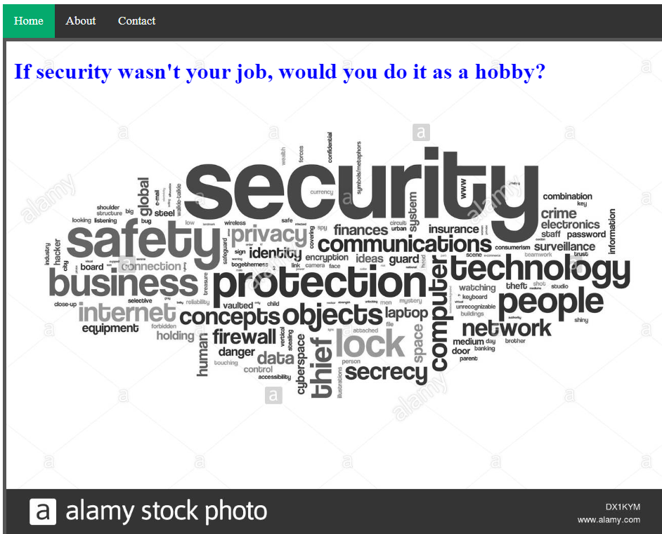
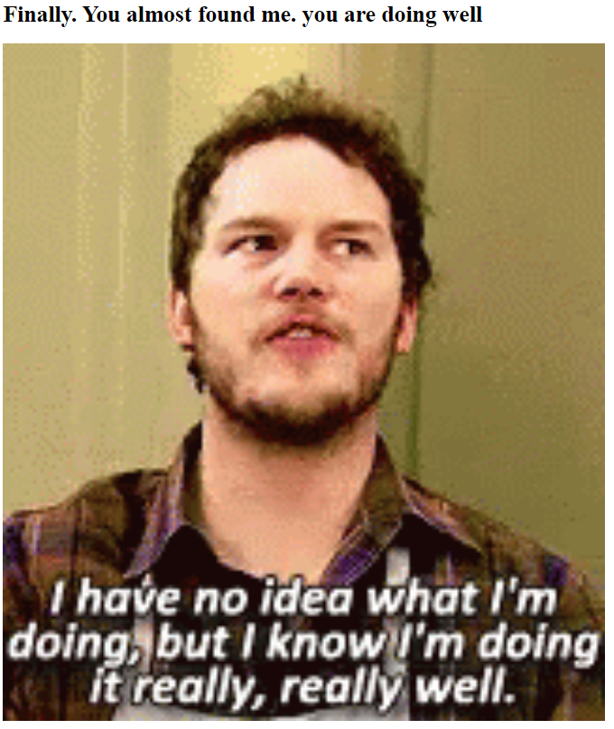
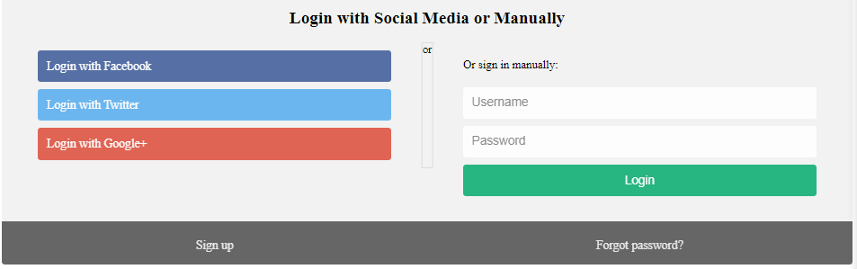
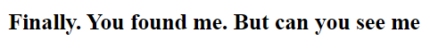

# Secrets

## Information

- picoCTF 2022
- Web Exploitation
- 200 Points

## Description

We have several pages hidden. Can you find the one with the flag?
The website is running [here](http://saturn.picoctf.net:62050/).

## Hints

1. folders folders folders

## Solution

We first see a webpage with a title and an alamy stock photo along with an "About" and "Contact" tab.



Looking at the sources of the website, we see a folder called `secret/assets`. Going to http://saturn.picoctf.net:62050/secret/ gives us this webpage:



Using the same trick, we can see another folder called `hidden` and going to http://saturn.picoctf.net:62050/secret/hidden/, we see a login page.



Again, using the same trick, we find another folder called `superhidden`. Going to http://saturn.picoctf.net:62050/secret/hidden/superhidden/, we get this message:



Going to the HTML file for this webpage, we can see the code on line 10.

```html
<!DOCTYPE html>
<html>
  <head>
    <title></title>
    <link rel="stylesheet" href="mycss.css" />
  </head>

  <body>
    <h1>Finally. You found me. But can you see me</h1>
    <h3 class="flag">picoCTF{succ3ss_@h3n1c@10n_51b260fe}</h3>
  </body>
</html>
```

## Flag

picoCTF{succ3ss\_@h3n1c@10n_51b260fe}
