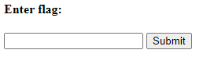

# Some Assembly Required 2

## Information

- picoCTF 2021
- Web Exploitation
- 110 Points

## Description

http://mercury.picoctf.net:1896/index.html

## Hints

(None)

## Solution

This challenge is similar to [Some Assembly Required 1](/web-exploitation/some-assembly-required-1/some-assembly-required-1.md).

When we first open the website we are meet with a flag checker.



Checking the JavaScript file, we need to deobfuscate it similar to how we did it for the first challenge and get a file called `aD8SvhyVkb`. Download the file and open it will reveal an encoded message at the bottom:

```
+xakgK\Nsmn;j8j<9;<?=l?k88mm1n9i1j>:8k?l0u
```

To find the flag, we need to perform XOR brute force. This can be done using [CyberChef](<https://gchq.github.io/CyberChef/#recipe=XOR_Brute_Force(1,100,0,'Standard',false,true,false,'')>).

The flag is then found when Key = 8. Ignore the '#' at the front.

## Flag

picoCTF{ef3b0b413475d7c00ee9f1a9b620c7d8}
