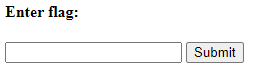

# Some Assembly Required 3

## Information

- picoCTF 2021
- Web Exploitation
- 160 Points

## Description

http://mercury.picoctf.net:10388/index.html

## Hints

(None)

## Solution

This challenge is similar to [Some Assembly Required 1](/web-exploitation/some-assembly-required-1/some-assembly-required-1.md) and [Some Assembly Required 2](/web-exploitation/some-assembly-required-2/some-assembly-required-2.md).

When we first open the website we are meet with a flag checker.

Checking the JavaScript file, we need to deobfuscate it similar to how we did it for the first challenge and get a file called `qCCYI0ajpD`.

## Flag
