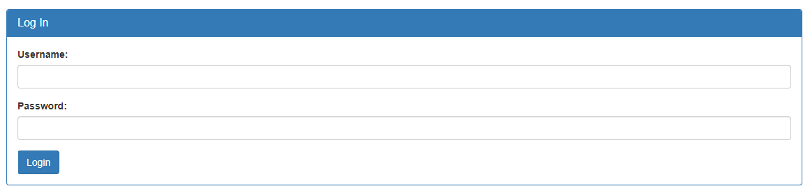

# SQLiLite

## Information

- picoCTF 2022
- Web Exploitation
- 300 Points

## Description

Can you login to this website?
Try to login [here](http://saturn.picoctf.net:63350/).

## Hints

1. `admin` is the user you want to login as.

## Solution

The website first shows us a log in form that we must complete before accessing the flag.



If we input `admin` as the username and `password` as the password we get redirected to the following webpage.


The webpage clearly tells us the SQL query used for the log in form.

To perform an SQL injection, log in with the username being `admin'--` and the password being any string. The SQL query will then be the following.

```sql
SELECT * FROM users WHERE name='admin'--' AND password='password'
```

This works because everything after `admin` is considered a string in SQL.

Once logged in as `admin`, we see the following webpage, telling us the flag is in plainsight.


Inspecting the HTML code, we can find the flag.

```html
<p hidden="">Your flag is: picoCTF{L00k5_l1k3_y0u_solv3d_it_9b0a4e21}</p>
```

## Flag

picoCTF{L00k5_l1k3_y0u_solv3d_it_9b0a4e21}
