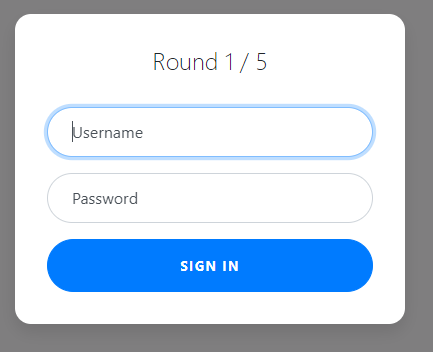

# Web Gauntlet

## Information

- picoCTF 2021
- Web Exploitation
- 170 Points

## Description

Can you beat the filters? Log in as admin http://jupiter.challenges.picoctf.org:44979/ http://jupiter.challenges.picoctf.org:44979/filter.php

## Hints

1. You are not allowed to login with valid credentials.

2. Write down the injections you use in case you lose your progress.

3. For some filters it may be hard to see the characters, always (always) look at the raw hex in the response.

4. sqlite

5. If your cookie keeps getting reset, try using a private browser window

## Solution

Visting http://mercury.picoctf.net:44979/ gives us a sign in form. We have to complete five rounds before we can get our flag.



In `filter.php`, we can see what the sign in form filters for each round.

### Round 1

For round 1, `filter.php` says the following is filtered.

```
Round1: or
```

So the username for this round is `admin'--` and the password is any string since `--` signifies a comment in SQL.

### Round 2

For round 2, `filter.php` says the following is filtered.

```
Round2: or and like = --
```

So the username for this round is `admin'/*` and the password is `*//*` since `/* comment */` is an alternative syntax for comments in SQLite.

### Round 3

For round 3, `filter.php` says the following is filtered.

```
Round3: or and = like > < --
```

We can use the same username and password here since it does not filter `/*` and `*/`.

### Round 4

For round 4, `filter.php` says the following is filtered.

```
Round4: or and = like > < -- admin
```

Since `admin` is now filtered we need to use the concatenate operation in SQLite which is `||`. So the username for this round is `ad'||'min'/*` and the password is `*//*`.

### Round 5

For round 5, `filter.php` says the following is filtered.

```
Round5: or and = like > < -- union admin
```

We can use the same username and password for this round as we did for round 4.

### Finished

Once you've completed all rounds, go to `filter.php` and there, php code will be shown and the flag will be at the bottom.

```php
<?php
session_start();

if (!isset($_SESSION["round"])) {
    $_SESSION["round"] = 1;
}
$round = $_SESSION["round"];
$filter = array("");
$view = ($_SERVER["PHP_SELF"] == "/filter.php");

if ($round === 1) {
    $filter = array("or");
    if ($view) {
        echo "Round1: ".implode(" ", $filter)."<br/>";
    }
} else if ($round === 2) {
    $filter = array("or", "and", "like", "=", "--");
    if ($view) {
        echo "Round2: ".implode(" ", $filter)."<br/>";
    }
} else if ($round === 3) {
    $filter = array(" ", "or", "and", "=", "like", ">", "<", "--");
    // $filter = array("or", "and", "=", "like", "union", "select", "insert", "delete", "if", "else", "true", "false", "admin");
    if ($view) {
        echo "Round3: ".implode(" ", $filter)."<br/>";
    }
} else if ($round === 4) {
    $filter = array(" ", "or", "and", "=", "like", ">", "<", "--", "admin");
    // $filter = array(" ", "/**/", "--", "or", "and", "=", "like", "union", "select", "insert", "delete", "if", "else", "true", "false", "admin");
    if ($view) {
        echo "Round4: ".implode(" ", $filter)."<br/>";
    }
} else if ($round === 5) {
    $filter = array(" ", "or", "and", "=", "like", ">", "<", "--", "union", "admin");
    // $filter = array("0", "unhex", "char", "/*", "*/", "--", "or", "and", "=", "like", "union", "select", "insert", "delete", "if", "else", "true", "false", "admin");
    if ($view) {
        echo "Round5: ".implode(" ", $filter)."<br/>";
    }
} else if ($round >= 6) {
    if ($view) {
        highlight_file("filter.php");
    }
} else {
    $_SESSION["round"] = 1;
}

// picoCTF{y0u_m4d3_1t_16f769e719ab9d3e310fd13dc1262ee1}
?>
```

## Flag

// picoCTF{y0u_m4d3_1t_16f769e719ab9d3e310fd13dc1262ee1}
