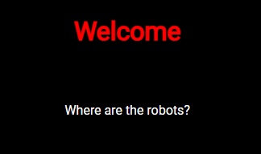
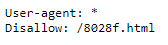
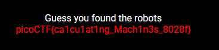

# where are the robots

## Information

- picoCTF 2019
- Web Exploitation
- 100 Points

## Description

Can you find the robots? `https://jupiter.challenges.picoctf.org/problem/60915/` ([link](https://jupiter.challenges.picoctf.org/problem/60915/)) or http://jupiter.challenges.picoctf.org:60915

## Hints

1. What part of the website could tell you where the creator doesn't want you to look?

## Solution

The webpage includes text which says "Where are the robots?" which may be a hint.

Robots alludes to the `robots.txt` file which is accessed with this URL: https://jupiter.challenges.picoctf.org/problem/60915/robots.txt. The file tells search engine crawlers which URLs the crawlers can access on your site.

Access the file we get the following:

The "Disallow" section of the file contains parts of the website search engine crawlers are not allowed to access and from the given hint we know we are on the right path.

Going to https://jupiter.challenges.picoctf.org/problem/60915/8028f.html we get the flag.

## Flag

picoCTF{ca1cu1at1ng_Mach1n3s_8028f}
