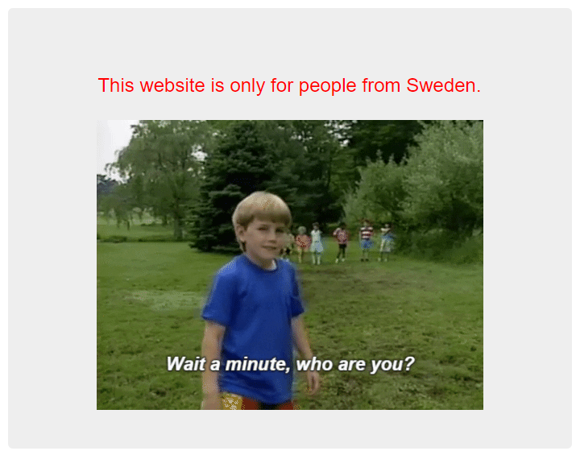

# Who are you?

## Information

- picoCTF 2021
- Web Exploitation
- 100 Points

## Description

Let me in. Let me iiiiiiinnnnnnnnnnnnnnnnnnnn http://mercury.picoctf.net:39114/

## Hints

1. It ain't much, but it's an RFC https://tools.ietf.org/html/rfc2616

## Solution

_Note: For all HTTP request messages add two empty lines to signify the end of the message._

Going to the website we are told only people who are using "PicoBrowser" are allowed to visit the website.


We need to use Burp Suite for this challenge as we need to modify parts of the HTTP request message. Using Burp Suite's ability to intercept HTTP traffic we can modify the [User-Agent](https://developer.mozilla.org/en-US/docs/Web/HTTP/Headers/User-Agent) characteristic from the current browser to "PicoBrowser" with `User-Agent: PicoBrowser`.

```
GET / HTTP/1.1
Host: mercury.picoctf.net:39114
User-Agent: Mozilla/5.0 (Windows NT 10.0; Win64; x64; rv:109.0) Gecko/20100101 Firefox/119.0
Accept: text/html,application/xhtml+xml,application/xml;q=0.9,image/avif,image/webp,*/*;q=0.8
Accept-Language: en-US,en;q=0.5
Accept-Encoding: gzip, deflate, br
Connection: close
Upgrade-Insecure-Requests: 1


```

Refreshing the page, we get an updated webpage telling us that the website does not trust users visiting from another site.


We need to add a new header in the HTTP request called [Referer](https://developer.mozilla.org/en-US/docs/Web/HTTP/Headers/Referer). For the url use mercury.picoctf.net:39114 so thatit looks like `Referer: mercury.picoctf.net:39114`.

```
GET / HTTP/1.1
Host: mercury.picoctf.net:39114
User-Agent: PicoBrowser
Accept: text/html,application/xhtml+xml,application/xml;q=0.9,image/avif,image/webp,*/*;q=0.8
Accept-Language: en-US,en;q=0.5
Accept-Encoding: gzip, deflate, br
Connection: close
Upgrade-Insecure-Requests: 1
Referer: http://mercury.picoctf.net:39114/


```

Refreshing the page, we get an updated webpage telling us the site on worked in 2018.


We need to add a new header in the HTTP request called [Date](https://developer.mozilla.org/en-US/docs/Web/HTTP/Headers/Date). Any date in 2018 should work.

```
GET / HTTP/1.1
Host: mercury.picoctf.net:39114
User-Agent: PicoBrowser
Accept: text/html,application/xhtml+xml,application/xml;q=0.9,image/avif,image/webp,*/*;q=0.8
Accept-Language: en-US,en;q=0.5
Accept-Encoding: gzip, deflate, br
Connection: close
Upgrade-Insecure-Requests: 1
Content-Length: 0
Referer: mercury.picoctf.net:39114
Date: Wed, 21 Oct 2018 07:28:00 GMT


```

Refreshing the page, we get an updated webpage telling us the the site does not trust users who can be tracked.


We need to add a new header in the HTTP request called [DNT](https://developer.mozilla.org/en-US/docs/Web/HTTP/Headers/DNT). For DNT, a `0` means tracking is allowed, `1` means tracking is not allowed and `null` means no preference. We therefore place a `1` here.

```
GET / HTTP/1.1
Host: mercury.picoctf.net:39114
User-Agent: PicoBrowser
Accept: text/html,application/xhtml+xml,application/xml;q=0.9,image/avif,image/webp,*/*;q=0.8
Accept-Language: en-US,en;q=0.5
Accept-Encoding: gzip, deflate, br
Connection: close
Upgrade-Insecure-Requests: 1
Content-Length: 0
Referer: mercury.picoctf.net:39114
Date: Wed, 21 Oct 2018 07:28:00 GMT
DNT: 1


```

Refreshing the page, we get an updated webpage telling us the the site only allows users from Sweden.



We need to add a new header in the HTTP request called [X-Forwarded-For](https://developer.mozilla.org/en-US/docs/Web/HTTP/Headers/X-Forwarded-For). To use this header we need an IP address from Sweden. The one I used here is an IP address in Stockholm, Sweden.

```
GET / HTTP/1.1
Host: mercury.picoctf.net:39114
User-Agent: PicoBrowser
Accept: text/html,application/xhtml+xml,application/xml;q=0.9,image/avif,image/webp,*/*;q=0.8
Accept-Language: en-US,en;q=0.5
Accept-Encoding: gzip, deflate, br
Connection: close
Upgrade-Insecure-Requests: 1
Content-Length: 0
Referer: mercury.picoctf.net:39114
Date: Wed, 21 Oct 2018 07:28:00 GMT
DNT: 1
X-Forwarded-For: 192.44.242.19


```

Refreshing the page, we get an updated webpage telling us we don't speak Swedish.


We need to add a new header in the HTTP request called [Accept-Language](hhttps://developer.mozilla.org/en-US/docs/Web/HTTP/Headers/Accept-Language). The Accept-Language string for Swedish is `se`. All languages can be found [here](https://www.w3.org/International/ms-lang.html).

```
GET / HTTP/1.1
Host: mercury.picoctf.net:39114
User-Agent: PicoBrowser
Accept: text/html,application/xhtml+xml,application/xml;q=0.9,image/avif,image/webp,*/*;q=0.8
Accept-Language: en-US,en;q=0.5
Accept-Encoding: gzip, deflate, br
Connection: close
Upgrade-Insecure-Requests: 1
Content-Length: 0
Referer: mercury.picoctf.net:39114
Date: Wed, 21 Oct 2018 07:28:00 GMT
DNT: 1
X-Forwarded-For: 192.44.242.19
Accept-Language: sv


```

Refreshing the page, we finally get the flag.


## Flag

picoCTF{http_h34d3rs_v3ry_c0Ol_much_w0w_20ace0e4}
